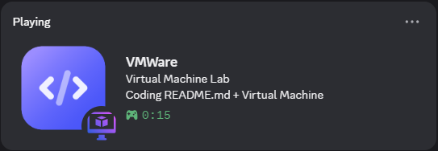

# 🖥️ VM Discord Rich Presence

A smart Discord Rich Presence tool that shows your Virtual Machine activity along with coding context.

---

# 🖥️ VM Discord Rich Presence


## 📸 Demo



## 🚀 Features

* Detects running Virtual Machines:

  * VirtualBox
  * VMware
  * Hyper-V
* Shows active VM name on Discord
* Detects if you are coding (VS Code / PyCharm)
* Displays:

  * 📁 Current file (like `main.py`)
  * 🖥️ VM name
* Uses dual icons:

  * 💻 Coding
  * 🖥️ Virtual Machine
* Automatically restores normal Discord presence when VM is closed

---

## 🎯 Example Presence

```
💻 Coding main.py + Kali Linux
```

---

## 🛠️ Installation

```bash
git clone https://github.com/your-username/vm-discord-presence.git
cd vm-discord-presence
pip install -r requirements.txt
```

---

## ⚙️ Setup

1. Create a Discord application at:
   https://discord.com/developers/applications

2. Copy **Application ID**

3. Add assets:

   * `code` (for coding)
   * `vm` (for virtual machine)

4. Paste your Client ID in `main.py`

---

## ▶️ Run

```bash
python main.py
```

---

## 🔥 Future Improvements

* Detect tools inside VM (nmap, metasploit)
* System tray app
* Auto-start on boot
* Cross-platform support

